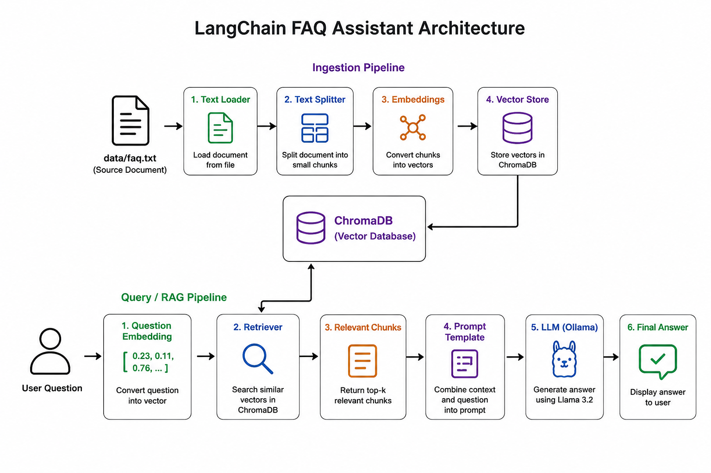
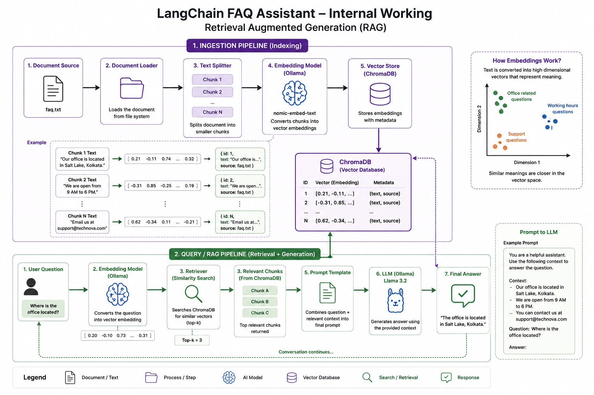

#  LangChain FAQ Assistant

<p align="center">
  
</p>

<p align="center">
  
</p>

<p align="center">
  <strong>A Retrieval-Augmented Generation (RAG) application built with LangChain, TypeScript, Ollama, and ChromaDB.</strong>
</p>

<p align="center">
  Answer questions from your own documents using local Large Language Models and vector search.
</p>

---

# 📖 Overview

LangChain FAQ Assistant is a lightweight RAG application that demonstrates how to build an AI-powered question answering system using a local LLM.

Instead of relying only on the model's knowledge, the application retrieves relevant information from a document stored inside a vector database before generating the final response.

The project is ideal for learning the complete RAG pipeline from document ingestion to semantic search and answer generation.

---

# ✨ Features

* 📄 Load text documents
* ✂️ Intelligent document chunking
* 🧠 Local embeddings with Ollama
* 📦 ChromaDB vector storage
* 🔍 Semantic similarity search
* 🤖 Local LLM inference (Llama 3.2)
* ⚡ Built with LangChain
* 💻 TypeScript support
* 🔒 Runs completely locally

---

# 🏗️ Architecture

```
User Question
      │
      ▼
Retriever
      │
      ▼
ChromaDB
      ▲
      │
Embeddings
      ▲
      │
Text Splitter
      ▲
      │
Document Loader
      ▲
      │
faq.txt

Retriever
      │
      ▼
Relevant Chunks
      │
      ▼
Prompt Template
      │
      ▼
Llama 3.2 (Ollama)
      │
      ▼
Final Answer
```

---

# 🛠 Tech Stack

| Technology       | Purpose               |
| ---------------- | --------------------- |
| TypeScript       | Programming Language  |
| Node.js          | Runtime               |
| LangChain        | AI Framework          |
| Ollama           | Local LLM             |
| Llama 3.2        | Chat Model            |
| nomic-embed-text | Embedding Model       |
| ChromaDB         | Vector Database       |
| dotenv           | Environment Variables |

---

# 📁 Project Structure

```text
langchain-faq-bot
│
├── assets/
│   └── architecture.png
│
├── data/
│   └── faq.txt
│
├── src/
│   ├── config/
│   │   ├── chroma.ts
│   │   └── ollama.ts
│   │
│   ├── ingest.ts
│   ├── chat.ts
│   └── index.ts
│
├── package.json
├── tsconfig.json
└── .env
```

---

# ⚙️ Installation

Clone the repository

```bash
git clone https://github.com/yourusername/langchain-faq-bot.git

cd langchain-faq-bot
```

Install dependencies

```bash
npm install
```

---

# 📦 Install Ollama Models

```bash
ollama pull llama3.2

ollama pull nomic-embed-text
```

---

# 🐳 Start ChromaDB

```bash
docker run -d \
-p 8000:8000 \
chromadb/chroma
```

---

# 🔧 Environment Variables

Create a `.env` file.

```env
OLLAMA_URL=http://localhost:11434

CHROMA_URL=http://localhost:8000
```

---

# 📄 Add Your Documents

Place your knowledge base inside

```
data/faq.txt
```

Example

```text
What are your office hours?

Our office is open from 9 AM to 6 PM.

Where is the office?

Salt Lake, Kolkata.
```

---

# 📥 Ingest Documents

Generate embeddings and store them in ChromaDB.

```bash
npm run ingest
```

Expected output

```text
Loading document...

Splitting document...

Creating embeddings...

Documents stored successfully.
```

---

# 💬 Start Chat

```bash
npm run chat
```

Example

```
Ask:
Where is the office?
```

Response

```
The office is located in Salt Lake, Kolkata.
```

---

# 🔄 RAG Workflow

```
FAQ Document
      │
      ▼
Document Loader
      │
      ▼
Text Splitter
      │
      ▼
Embeddings
      │
      ▼
ChromaDB
      │
──────────────────────────────
      │
User Question
      │
      ▼
Retriever
      │
      ▼
Relevant Chunks
      │
      ▼
Prompt Template
      │
      ▼
Llama 3.2
      │
      ▼
Final Answer
```

---

# 📚 What You'll Learn

* LangChain Fundamentals
* Prompt Templates
* Document Loading
* Recursive Text Splitting
* Embeddings
* Chroma Vector Database
* Semantic Search
* Retrieval-Augmented Generation (RAG)
* Ollama Integration
* Local AI Applications

---

# 🚀 Future Improvements

* PDF document support
* DOCX support
* Website loader
* Conversation memory
* Multiple document collections
* Hybrid search
* Metadata filtering
* Streaming responses
* REST API
* Authentication
* Web UI
* Docker Compose
* Kubernetes deployment

---

# 🤝 Contributing

Contributions, suggestions, and improvements are welcome.

1. Fork the repository
2. Create a feature branch
3. Commit your changes
4. Push to your fork
5. Open a Pull Request

---

# 📄 License

This project is licensed under the MIT License.

---

<p align="center">
Built with ❤️ using <strong>LangChain</strong>, <strong>Ollama</strong>, <strong>ChromaDB</strong>, and <strong>TypeScript</strong>.
</p>
